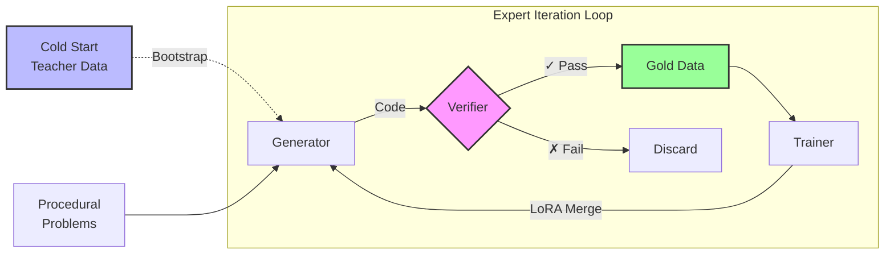

# axiom-rl: Axiomatic Reinforcement Learning

**Self-Improving Reasoning via Verifiable Value Functions**

`axiom-rl` is a research framework investigating the "Straight Shot" to AGI: the hypothesis that Large Language Models can achieve continual improvement not by scaling parameters, but by scaling **inference-time compute** and **self-verification**.

Inspired by recent discussions by Ilya Sutskever (SSI), AlphaZero, and the architectures behind reasoning models (like DeepSeek-R1 and OpenAI o1), this project implements a closed-loop system where a model learns from its own interaction with a verifiable environment (Python Interpreter).

## 🧪 Core Hypothesis

Current LLMs excel at the **Policy** (predicting the next token) but lack a robust **Value Function** (intuition for correctness). Standard RLHF relies on human supervision, which is finite and subjective.

**axiom-rl** aims to solve this by implementing **Expert Iteration** on objective domains:

1.  **Verification \> Mimicry:** A model shouldn't just copy training data; it should generate solutions that pass objective unit tests.
2.  **Inference-Time Search:** Using compute at runtime to explore "reasoning paths" (System 2 thinking).
3.  **The Feedback Loop:** Converting temporary "search insights" into permanent "weights" via self-generated synthetic data.

## ⚙️ Architecture

The system implements a complete **Expert Iteration** pipeline with four key subsystems:



### Core Components

1. **Cold Start:** Teacher-generated reasoning traces (via Gemini) that bootstrap stable output formatting before self-improvement begins.

2. **Procedural Generation:** Infinite unique problems with mathematically provable correct answers—no human annotation needed.

3. **The Generator (Actor):** An open-weights model (Qwen2.5-Coder) that generates solutions with optional reasoning traces (`<think>` tags learned from cold start).

4. **The Verifier (Sandbox):** A secure Python execution environment that tests generated code against known correct answers. For procedural problems, verification is exact-match against computed ground truth.

5. **The Trainer (Learner):** LoRA-based fine-tuning on verified solutions. After training, weights are **merged** back into the base model for full inference speed.

## 💡 Why This Is Different From Supervised Learning

A common question: *"If we're using test cases to validate, aren't we just doing supervised learning with labels?"*

**No.** The key distinction is **what** the test cases represent:

| Aspect | Traditional Supervised Learning | Axiom-RL (Expert Iteration) |
|--------|--------------------------------|----------------------------|
| **Training Signal** | Human-written "gold" solutions | Model's own verified outputs |
| **What's Labeled** | The exact code to produce | The *behavior* (input→output) |
| **Learning Goal** | Mimic human code style | Discover *any* working solution |
| **Data Source** | Static human dataset | Self-generated, infinitely scalable |

### The AlphaGo Analogy

Think of it like AlphaGo vs. traditional chess engines:

- **Traditional approach:** Learn from databases of grandmaster games (supervised)
- **AlphaGo approach:** Learn from games *it plays against itself*, where the only signal is "did I win?"

Similarly, in axiom-rl:

- **Traditional code training:** Learn from human-written code on GitHub
- **Our approach:** Learn from code *the model generates itself*, where the only signal is "did it pass the tests?"

### The Test Cases Are The Environment, Not The Teacher

The test cases define the **rules of the game** (like a chess board), not the **moves to make** (like a human demonstrator). The model must:

1. **Explore** - Generate diverse candidate solutions (Best-of-N sampling)
2. **Discover** - Find solutions that satisfy the environment (pass tests)
3. **Improve** - Train on its own discoveries to get better at exploring

This creates a **self-improvement loop** where:
- Model N generates solutions → verified → trains Model N+1
- Model N+1 solves *harder* problems → trains Model N+2
- ...and so on, without requiring new human-labeled data

## 🚀 Roadmap

> **Status Legend:** 🔬 = Implemented, needs validation | ⏳ = In progress | 📋 = Planned

### Phase 0: Foundation & Stability

| Phase | Name | Status | Description |
|-------|------|--------|-------------|
| 0 | **Cold Start** | 🔬 v0.1 | Teacher data from Gemini 2.5 with `<think>` reasoning traces. Stabilizes output format before self-improvement. [Details](docs/phase0-cold-start.md) |

### Phases 1-4: Core Infrastructure

| Phase | Name | Status | Description |
|-------|------|--------|-------------|
| 1 | **The Verifier** | 🔬 v0.1 | Secure Python sandbox for code execution and test validation |
| 2 | **The Generator** | 🔬 v0.1 | HuggingFace/vLLM inference with Best-of-N sampling |
| 3 | **The Loop** | 🔬 v0.1 | Automated pipeline: Prompt → Generate → Verify → Save |
| 4 | **The Trainer** | 🔬 v0.1 | LoRA-based fine-tuning with Model N → N+1 comparison |

### Phases 5-6: Scaling & Science

| Phase | Name | Status | Description |
|-------|------|--------|-------------|
| 5 | **Procedural Generation** | 🔬 v0.1 | Infinite unique problems (Arithmetic, RPN, Parentheses, List Ops) with perfect ground truth. [Details](docs/phase5-procedural-generation.md) |
| 6 | **Self-Improvement Loop** | 🔬 v0.1 | Full Expert Iteration cycle: Generate → Verify → Train → Repeat. Includes LoRA merge optimization for 3x faster iterations. [Details](docs/phase6-self-improvement-results.md) |

### Preliminary Results (Phase 6)

```
┌─────────────────────────────────────────────────────────────────┐
│                 INITIAL SELF-IMPROVEMENT TEST                    │
├─────────────────────────────────────────────────────────────────┤
│                                                                  │
│  Baseline Accuracy (Model N):                                    │
│    Train: 50%  │  Validation: 33%  │  Test: 50%                 │
│                                                                  │
│  After 1 Iteration (Model N+1):                                  │
│    Training loss decreased 32% (1.32 → 0.89)                    │
│    Model successfully learned from 9 self-generated solutions   │
│                                                                  │
│  Observation: Pipeline functional, training shows learning.      │
│  Further validation needed across more iterations.               │
│                                                                  │
└─────────────────────────────────────────────────────────────────┘
```

### Upcoming Phases

| Phase | Name | Status | Goal |
|-------|------|--------|------|
| 7 | **Replay Buffer** | 📋 | Prevent catastrophic forgetting with mixed training: 50% new solutions, 40% historical successes, 10% cold start data |
| 8 | **Extended Experiments** | 📋 | Run 50-100 iterations to observe "grokking" (sudden generalization jump) |
| 9 | **Curriculum Learning** | 📋 | Progressively increase problem difficulty as model improves |
| 10 | **Multi-Task Transfer** | 📋 | Test if learning one problem type improves performance on others |

### Research Questions

- **Does grokking occur?** Can we observe sudden generalization after extended training?
- **Does self-improvement scale?** Does Model N+10 outperform Model N+1?
- **Does reasoning transfer?** Do `<think>` traces improve performance on new problem types?

## 🛠️ Tech Stack

  * **Language:** Python 3.10+
  * **Inference:** `transformers`, `vLLM` (optional for speed)
  * **Training:** `peft` (LoRA), `bitsandbytes`, `pytorch`
  * **Environment:** `multiprocessing` sandbox for code execution

## 🚀 Quick Start

### Prerequisites

- Python 3.10+
- [UV](https://docs.astral.sh/uv/) package manager
- CUDA-capable GPU (recommended: 12GB+ VRAM)

### Installation

```bash
# Clone the repository
git clone https://github.com/yourusername/axiom-rl.git
cd axiom-rl

# Create virtual environment and install dependencies with UV
uv venv
uv pip install -e .

# Or install with dev dependencies
uv pip install -e ".[dev]"
```

### Running the Pipeline

```bash
# Activate the virtual environment
# Windows:
.venv\Scripts\activate
# Linux/Mac:
source .venv/bin/activate

# List available problems
uv run python scripts/run_pipeline.py --list-problems

# Run on all problems (default: Qwen2.5-Coder-7B)
uv run python scripts/run_pipeline.py

# Run on specific problems
uv run python scripts/run_pipeline.py --problems two_sum fizzbuzz reverse_string

# Use a smaller model for faster iteration
uv run python scripts/run_pipeline.py --model Qwen/Qwen2.5-Coder-1.5B-Instruct

# Generate more samples per problem (increases chance of finding solutions)
uv run python scripts/run_pipeline.py --samples 16

# Skip already-solved problems (useful for resuming)
uv run python scripts/run_pipeline.py --skip-existing
```

### CLI Options

| Option | Default | Description |
|--------|---------|-------------|
| `--model` | `Qwen/Qwen2.5-Coder-7B-Instruct` | HuggingFace model to use |
| `--samples` | `8` | Number of solutions to generate per problem (Best-of-N) |
| `--problems` | all | Specific problem IDs to run |
| `--timeout` | `5.0` | Execution timeout in seconds |
| `--temperature` | `0.7` | Sampling temperature |
| `--max-attempts` | `3` | Retry attempts per problem |
| `--output-dir` | `data/synthetic` | Output directory |
| `--skip-existing` | false | Skip already-solved problems |
| `--list-problems` | - | List available problems and exit |

### Output

Successful solutions are saved to `data/synthetic/solutions.jsonl` in JSONL format:

```json
{
  "problem_id": "two_sum",
  "problem_title": "Two Sum",
  "solution_code": "def two_sum(nums, target):\n    ...",
  "passed_tests": 4,
  "total_tests": 4,
  "model_name": "Qwen/Qwen2.5-Coder-7B-Instruct",
  "timestamp": "2024-01-15T10:30:00"
}
```

## 🎓 Phase 4: Training (LoRA SFT)

Once you have collected verified solutions, train the model on its own successful outputs:

### Running Training

```bash
# Train with default settings (uses solutions_baseline.jsonl)
uv run python scripts/run_training.py

# Train on a specific solutions file
uv run python scripts/run_training.py --solutions data/synthetic/solutions_exp1.jsonl

# Adjust LoRA parameters
uv run python scripts/run_training.py --lora-r 32 --lora-alpha 64

# Name the experiment
uv run python scripts/run_training.py --experiment v1

# Use more epochs
uv run python scripts/run_training.py --epochs 5 --lr 1e-4
```

### Training CLI Options

| Option | Default | Description |
|--------|---------|-------------|
| `--model` | `Qwen/Qwen2.5-Coder-1.5B-Instruct` | Base model to fine-tune |
| `--solutions` | `data/synthetic/solutions_baseline.jsonl` | Path to solutions file |
| `--lora-r` | `16` | LoRA rank |
| `--lora-alpha` | `32` | LoRA scaling factor |
| `--epochs` | `3` | Number of training epochs |
| `--batch-size` | `1` | Per-device batch size |
| `--grad-accum` | `8` | Gradient accumulation steps |
| `--lr` | `2e-4` | Learning rate |
| `--experiment` | - | Experiment name (saves to models/lora-sft-{name}) |

### Testing the Fine-Tuned Model

After training, compare Model N+1 against the baseline:

```bash
# Run baseline (Model N)
uv run python scripts/run_pipeline.py --model Qwen/Qwen2.5-Coder-1.5B-Instruct --experiment baseline

# Run fine-tuned model (Model N+1)
uv run python scripts/run_pipeline.py --model models/lora-sft --experiment finetuned

# Compare results
# solutions_baseline.jsonl vs solutions_finetuned.jsonl
```

## 🔄 Phase 6: Self-Improvement Experiments

Run the full Expert Iteration loop with procedural problems:

### Running Self-Improvement

```bash
# Quick test (small scale)
uv run python scripts/run_self_improve.py --experiment test_v1

# Full run with more iterations
uv run python scripts/run_self_improve.py \
    --experiment full_v1 \
    --train-size 100 \
    --iterations 10

# Customize problem types
uv run python scripts/run_self_improve.py \
    --problem-types arithmetic rpn \
    --min-difficulty 5 \
    --max-difficulty 9
```

### Self-Improvement CLI Options

| Option | Default | Description |
|--------|---------|-------------|
| `--experiment` | `self_improve_v1` | Experiment name |
| `--model` | `Qwen/Qwen2.5-Coder-1.5B-Instruct` | Base model |
| `--train-size` | `30` | Training problems |
| `--val-size` | `10` | Validation problems |
| `--test-size` | `10` | Test problems |
| `--iterations` | `3` | Self-improvement iterations |
| `--problem-types` | `arithmetic rpn parentheses` | Problem types |
| `--min-difficulty` | `3` | Minimum difficulty (1-10) |
| `--max-difficulty` | `7` | Maximum difficulty (1-10) |
| `--lr` | `2e-4` | Learning rate |

### What Happens During Self-Improvement

Each iteration:
1. **Evaluate** - Test model on train/val/test sets
2. **Collect** - Gather correct solutions from training problems
3. **Train** - Fine-tune with LoRA on correct solutions
4. **Repeat** - Next iteration uses improved model

### Output Structure

```
experiments/{experiment_name}/
├── config.json              # Experiment settings
├── metrics.jsonl            # Accuracy at each iteration
├── train.jsonl              # Training problems
├── val.jsonl                # Validation problems
├── test.jsonl               # Test problems
└── solutions/
    ├── iter_0.jsonl         # Correct solutions from iteration 0
    ├── iter_1.jsonl         # Correct solutions from iteration 1
    └── ...
```

## 📊 Experimental Results

### Phase 4: Hand-Crafted Problems (Initial Validation)

Our first experiment validated Expert Iteration on 10 LeetCode-style problems:

| Parameter | Value |
|-----------|-------|
| **Base Model** | Qwen/Qwen2.5-Coder-1.5B-Instruct |
| **Training Data** | 50 self-generated verified solutions |
| **Problems** | 10 algorithmic problems (LeetCode Easy) |

**Result: 62% → 96% per-sample pass rate (+54% improvement)**

The model learned to consistently produce working code from its own verified outputs. See [full details](#phase-4-detailed-results) below.

### Phase 6: Procedural Problems (Self-Improvement Loop)

We then tested the full Expert Iteration loop on procedurally generated problems:

| Parameter | Value |
|-----------|-------|
| **Problem Types** | Arithmetic, RPN, Parentheses |
| **Difficulty** | 3-7 (medium) |
| **Train/Val/Test** | 18 / 6 / 6 problems |

```
┌─────────────────────────────────────────────────────────────────┐
│                    ITERATION 0 (Baseline)                        │
├─────────────────────────────────────────────────────────────────┤
│                                                                  │
│   Train Accuracy:  50%   (9/18 correct)                         │
│   Val Accuracy:    33%   (2/6 correct)                          │
│   Test Accuracy:   50%   (3/6 correct)                          │
│                                                                  │
│   Solutions Collected: 9 verified correct                        │
│   Training Loss: 1.32 → 0.89 (32% decrease)                     │
│                                                                  │
└─────────────────────────────────────────────────────────────────┘
```

**Key Findings:**
- The complete pipeline works: Generate → Verify → Train → Repeat
- Model successfully learns from self-generated correct solutions
- Different problem types show varied difficulty (RPN: high success, Arithmetic: low)

See [docs/phase6-self-improvement-results.md](docs/phase6-self-improvement-results.md) for full details.

---

### Phase 4 Detailed Results

```
┌─────────────────────────────────────────────────────────────────┐
│                    PER-SAMPLE PASS RATE                         │
├─────────────────────────────────────────────────────────────────┤
│                                                                 │
│  Baseline (N)    ████████████████████████░░░░░░░░░░░░░░  62.5%  │
│                                                                 │
│  Fine-tuned (N+1) ██████████████████████████████████████  96.3% │
│                                                                 │
└─────────────────────────────────────────────────────────────────┘
                         +54% improvement
```

| Metric | Baseline | Fine-tuned | Change |
|--------|----------|------------|--------|
| **Solve Rate** | 100% (10/10) | 100% (10/10) | — |
| **Per-Sample Pass Rate** | 62.5% (50/80) | 96.3% (77/80) | **+54%** |
| **Failed Samples** | 30 | 3 | **-90%** |

### Conclusions

1. **Expert Iteration Works**: Models improve by learning from verified self-generated solutions
2. **No Human Labels Required**: All training data comes from model + verifier
3. **Scalable**: Procedural generation provides infinite fresh problems
4. **Efficient**: LoRA training + merge keeps iterations fast (~14 min/iteration)

## 📚 References & Inspiration

  * **Ilya Sutskever:** *The Age of Research / Safe Superintelligence* (Concept of the "Value Function" and "Straight Shot").
  * **DeepMind:** *AlphaZero* (Self-play reinforcement learning).
  * **DeepSeek:** *DeepSeek-R1 / Coder* (Reasoning-focused architectures).
  * **Research Papers:**
      * *STaR: Self-Taught Reasoner* (Zelikman et al.)
      * *Expert Iteration* (Anthony et al.)

-----

## Author

**Danilo Canivel**

## License

MIT License

Copyright (c) 2025 Danilo Canivel

Permission is hereby granted, free of charge, to any person obtaining a copy
of this software and associated documentation files (the "Software"), to deal
in the Software without restriction, including without limitation the rights
to use, copy, modify, merge, publish, distribute, sublicense, and/or sell
copies of the Software, and to permit persons to whom the Software is
furnished to do so, subject to the following conditions:

The above copyright notice and this permission notice shall be included in all
copies or substantial portions of the Software.

THE SOFTWARE IS PROVIDED "AS IS", WITHOUT WARRANTY OF ANY KIND, EXPRESS OR
IMPLIED, INCLUDING BUT NOT LIMITED TO THE WARRANTIES OF MERCHANTABILITY,
FITNESS FOR A PARTICULAR PURPOSE AND NONINFRINGEMENT. IN NO EVENT SHALL THE
AUTHORS OR COPYRIGHT HOLDERS BE LIABLE FOR ANY CLAIM, DAMAGES OR OTHER
LIABILITY, WHETHER IN AN ACTION OF CONTRACT, TORT OR OTHERWISE, ARISING FROM,
OUT OF OR IN CONNECTION WITH THE SOFTWARE OR THE USE OR OTHER DEALINGS IN THE
SOFTWARE.
