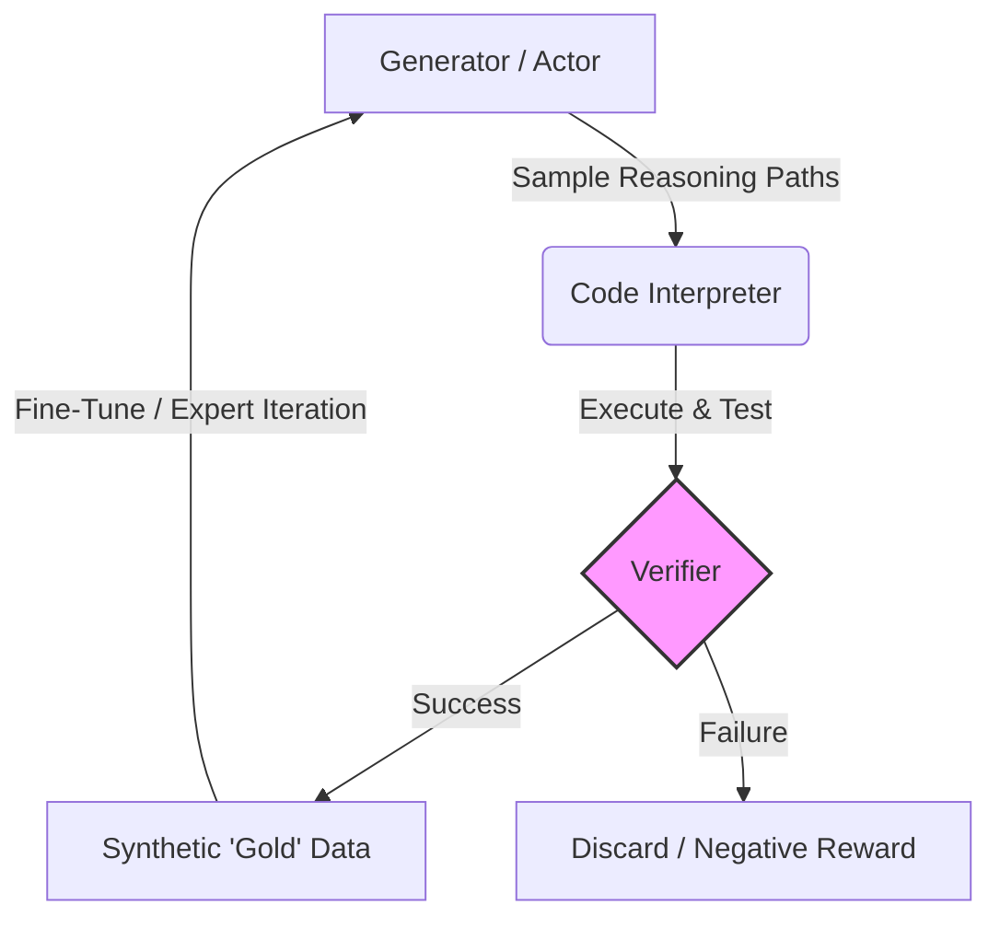

# axiom-rl

**Self-Improving Reasoning via Verifiable Value Functions**

`axiom-rl` is a research framework investigating the "Straight Shot" to AGI: the hypothesis that Large Language Models can achieve continual improvement not by scaling parameters, but by scaling **inference-time compute** and **self-verification**.

Inspired by recent discussions by Ilya Sutskever (SSI), AlphaZero, and the architectures behind reasoning models (like DeepSeek-R1 and OpenAI o1), this project implements a closed-loop system where a model learns from its own interaction with a verifiable environment (Python Interpreter).

## 🧪 Core Hypothesis

Current LLMs excel at the **Policy** (predicting the next token) but lack a robust **Value Function** (intuition for correctness). Standard RLHF relies on human supervision, which is finite and subjective.

**axiom-rl** aims to solve this by implementing **Expert Iteration** on objective domains:

1.  **Verification \> Mimicry:** A model shouldn't just copy training data; it should generate solutions that pass objective unit tests.
2.  **Inference-Time Search:** Using compute at runtime to explore "reasoning paths" (System 2 thinking).
3.  **The Feedback Loop:** Converting temporary "search insights" into permanent "weights" via self-generated synthetic data.

## ⚙️ Architecture

The system consists of three distinct modules operating in a cycle:

1.  **The Generator (Actor):** An open-weights model (e.g., Llama-3, Qwen-Coder) tasked with solving algorithmic problems via Chain-of-Thought.
2.  **The Verifier (Environment):** A sandboxed execution engine that runs generated Python code against hidden test cases. It acts as the "Judge," providing binary or scalar rewards based on functional correctness (not text similarity).
3.  **The Trainer (Learner):** A training loop that performs **Distillation/Optimization**. It updates the base model to maximize the likelihood of the verified solutions, minimizing the KL Divergence between the model's raw output and the "successful" search paths.

## 🚀 Roadmap

  - [ ] **Phase 1: The Verifier (Ground Truth)**
      - Implement a secure, robust Python execution sandbox.
      - Create a test-harness for LeetCode-style algorithmic problems.
  - [ ] **Phase 2: The Generator (Exploration)**
      - Integreate an inference engine (e.g., vLLM/HuggingFace).
      - Implement "Best-of-N" sampling to generate candidate solutions.
  - [ ] **Phase 3: The Loop (Data Factory)**
      - Automate the pipeline: Prompt -\> Generate -\> Verify -\> Save.
      - Create a dataset of "Self-Solved" problems.
  - [ ] **Phase 4: The Trainer (Optimization)**
      - Implement the fine-tuning loop (SFT or Direct Preference Optimization) on the synthetic data.
      - Demonstrate performance uplift (Model N+1 \> Model N).

## 🛠️ Tech Stack

  * **Language:** Python 3.10+
  * **Inference:** `transformers`, `vLLM` (optional for speed)
  * **Training:** `peft`, `bitsandbytes`, `pytorch`
  * **Environment:** `multiprocessing` (Initial), `Docker` (Planned)

## 📚 References & Inspiration

  * **Ilya Sutskever:** *The Age of Research / Safe Superintelligence* (Concept of the "Value Function" and "Straight Shot").
  * **DeepMind:** *AlphaZero* (Self-play reinforcement learning).
  * **DeepSeek:** *DeepSeek-R1 / Coder* (Reasoning-focused architectures).
  * **Research Papers:**
      * *STaR: Self-Taught Reasoner* (Zelikman et al.)
      * *Expert Iteration* (Anthony et al.)

-----

### License

MIT