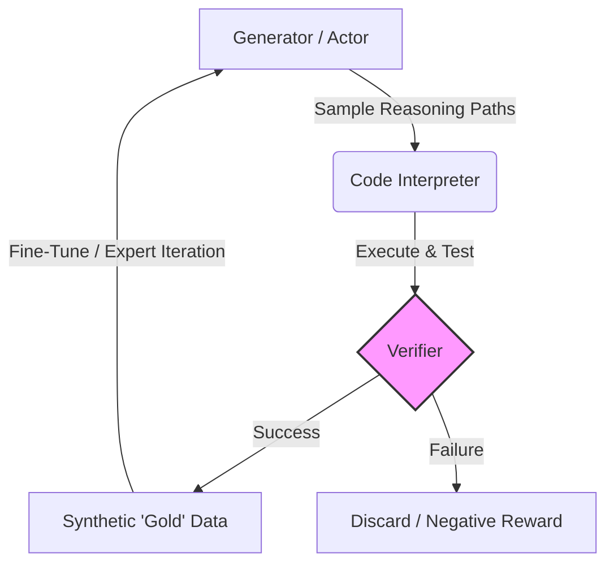

# axiom-rl

**Self-Improving Reasoning via Verifiable Value Functions**

`axiom-rl` is a research framework investigating the "Straight Shot" to AGI: the hypothesis that Large Language Models can achieve continual improvement not by scaling parameters, but by scaling **inference-time compute** and **self-verification**.

Inspired by recent discussions by Ilya Sutskever (SSI), AlphaZero, and the architectures behind reasoning models (like DeepSeek-R1 and OpenAI o1), this project implements a closed-loop system where a model learns from its own interaction with a verifiable environment (Python Interpreter).

## 🧪 Core Hypothesis

Current LLMs excel at the **Policy** (predicting the next token) but lack a robust **Value Function** (intuition for correctness). Standard RLHF relies on human supervision, which is finite and subjective.

**axiom-rl** aims to solve this by implementing **Expert Iteration** on objective domains:

1.  **Verification \> Mimicry:** A model shouldn't just copy training data; it should generate solutions that pass objective unit tests.
2.  **Inference-Time Search:** Using compute at runtime to explore "reasoning paths" (System 2 thinking).
3.  **The Feedback Loop:** Converting temporary "search insights" into permanent "weights" via self-generated synthetic data.

## ⚙️ Architecture

The system consists of three distinct modules operating in a cycle:



1.  **The Generator (Actor):** An open-weights model (e.g., Llama-3, Qwen-Coder) tasked with solving algorithmic problems via Chain-of-Thought.
2.  **The Verifier (Environment):** A sandboxed execution engine that runs generated Python code against hidden test cases. It acts as the "Judge," providing binary or scalar rewards based on functional correctness (not text similarity).
3.  **The Trainer (Learner):** A training loop that performs **Distillation/Optimization**. It updates the base model to maximize the likelihood of the verified solutions, minimizing the KL Divergence between the model's raw output and the "successful" search paths.

## 💡 Why This Is Different From Supervised Learning

A common question: *"If we're using test cases to validate, aren't we just doing supervised learning with labels?"*

**No.** The key distinction is **what** the test cases represent:

| Aspect | Traditional Supervised Learning | Axiom-RL (Expert Iteration) |
|--------|--------------------------------|----------------------------|
| **Training Signal** | Human-written "gold" solutions | Model's own verified outputs |
| **What's Labeled** | The exact code to produce | The *behavior* (input→output) |
| **Learning Goal** | Mimic human code style | Discover *any* working solution |
| **Data Source** | Static human dataset | Self-generated, infinitely scalable |

### The AlphaGo Analogy

Think of it like AlphaGo vs. traditional chess engines:

- **Traditional approach:** Learn from databases of grandmaster games (supervised)
- **AlphaGo approach:** Learn from games *it plays against itself*, where the only signal is "did I win?"

Similarly, in axiom-rl:

- **Traditional code training:** Learn from human-written code on GitHub
- **Our approach:** Learn from code *the model generates itself*, where the only signal is "did it pass the tests?"

### The Test Cases Are The Environment, Not The Teacher

The test cases define the **rules of the game** (like a chess board), not the **moves to make** (like a human demonstrator). The model must:

1. **Explore** - Generate diverse candidate solutions (Best-of-N sampling)
2. **Discover** - Find solutions that satisfy the environment (pass tests)
3. **Improve** - Train on its own discoveries to get better at exploring

This creates a **self-improvement loop** where:
- Model N generates solutions → verified → trains Model N+1
- Model N+1 solves *harder* problems → trains Model N+2
- ...and so on, without requiring new human-labeled data

## 🚀 Roadmap

  - [x] **Phase 1: The Verifier (Ground Truth)**
      - Implement a secure, robust Python execution sandbox.
      - Create a test-harness for LeetCode-style algorithmic problems.
  - [x] **Phase 2: The Generator (Exploration)**
      - Integrate an inference engine (e.g., vLLM/HuggingFace).
      - Implement "Best-of-N" sampling to generate candidate solutions.
  - [x] **Phase 3: The Loop (Data Factory)**
      - Automate the pipeline: Prompt -\> Generate -\> Verify -\> Save.
      - Create a dataset of "Self-Solved" problems.
  - [x] **Phase 4: The Trainer (Optimization)**
      - Implement LoRA-based SFT training on synthetic data.
      - Compare Model N+1 vs Model N performance.

## 🛠️ Tech Stack

  * **Language:** Python 3.10+
  * **Inference:** `transformers`, `vLLM` (optional for speed)
  * **Training:** `peft` (LoRA), `bitsandbytes`, `pytorch`
  * **Environment:** `multiprocessing` sandbox for code execution

## 🚀 Quick Start

### Prerequisites

- Python 3.10+
- [UV](https://docs.astral.sh/uv/) package manager
- CUDA-capable GPU (recommended: 12GB+ VRAM)

### Installation

```bash
# Clone the repository
git clone https://github.com/yourusername/axiom-rl.git
cd axiom-rl

# Create virtual environment and install dependencies with UV
uv venv
uv pip install -e .

# Or install with dev dependencies
uv pip install -e ".[dev]"
```

### Running the Pipeline

```bash
# Activate the virtual environment
# Windows:
.venv\Scripts\activate
# Linux/Mac:
source .venv/bin/activate

# List available problems
uv run python scripts/run_pipeline.py --list-problems

# Run on all problems (default: Qwen2.5-Coder-7B)
uv run python scripts/run_pipeline.py

# Run on specific problems
uv run python scripts/run_pipeline.py --problems two_sum fizzbuzz reverse_string

# Use a smaller model for faster iteration
uv run python scripts/run_pipeline.py --model Qwen/Qwen2.5-Coder-1.5B-Instruct

# Generate more samples per problem (increases chance of finding solutions)
uv run python scripts/run_pipeline.py --samples 16

# Skip already-solved problems (useful for resuming)
uv run python scripts/run_pipeline.py --skip-existing
```

### CLI Options

| Option | Default | Description |
|--------|---------|-------------|
| `--model` | `Qwen/Qwen2.5-Coder-7B-Instruct` | HuggingFace model to use |
| `--samples` | `8` | Number of solutions to generate per problem (Best-of-N) |
| `--problems` | all | Specific problem IDs to run |
| `--timeout` | `5.0` | Execution timeout in seconds |
| `--temperature` | `0.7` | Sampling temperature |
| `--max-attempts` | `3` | Retry attempts per problem |
| `--output-dir` | `data/synthetic` | Output directory |
| `--skip-existing` | false | Skip already-solved problems |
| `--list-problems` | - | List available problems and exit |

### Output

Successful solutions are saved to `data/synthetic/solutions.jsonl` in JSONL format:

```json
{
  "problem_id": "two_sum",
  "problem_title": "Two Sum",
  "solution_code": "def two_sum(nums, target):\n    ...",
  "passed_tests": 4,
  "total_tests": 4,
  "model_name": "Qwen/Qwen2.5-Coder-7B-Instruct",
  "timestamp": "2024-01-15T10:30:00"
}
```

## 🎓 Phase 4: Training (LoRA SFT)

Once you have collected verified solutions, train the model on its own successful outputs:

### Running Training

```bash
# Train with default settings (uses solutions_baseline.jsonl)
uv run python scripts/run_training.py

# Train on a specific solutions file
uv run python scripts/run_training.py --solutions data/synthetic/solutions_exp1.jsonl

# Adjust LoRA parameters
uv run python scripts/run_training.py --lora-r 32 --lora-alpha 64

# Name the experiment
uv run python scripts/run_training.py --experiment v1

# Use more epochs
uv run python scripts/run_training.py --epochs 5 --lr 1e-4
```

### Training CLI Options

| Option | Default | Description |
|--------|---------|-------------|
| `--model` | `Qwen/Qwen2.5-Coder-1.5B-Instruct` | Base model to fine-tune |
| `--solutions` | `data/synthetic/solutions_baseline.jsonl` | Path to solutions file |
| `--lora-r` | `16` | LoRA rank |
| `--lora-alpha` | `32` | LoRA scaling factor |
| `--epochs` | `3` | Number of training epochs |
| `--batch-size` | `1` | Per-device batch size |
| `--grad-accum` | `8` | Gradient accumulation steps |
| `--lr` | `2e-4` | Learning rate |
| `--experiment` | - | Experiment name (saves to models/lora-sft-{name}) |

### Testing the Fine-Tuned Model

After training, compare Model N+1 against the baseline:

```bash
# Run baseline (Model N)
uv run python scripts/run_pipeline.py --model Qwen/Qwen2.5-Coder-1.5B-Instruct --experiment baseline

# Run fine-tuned model (Model N+1)
uv run python scripts/run_pipeline.py --model models/lora-sft --experiment finetuned

# Compare results
# solutions_baseline.jsonl vs solutions_finetuned.jsonl
```

## 📊 Experimental Results

We ran an initial experiment to validate the Expert Iteration hypothesis using a single NVIDIA GPU.

### Experimental Setup

| Parameter | Value |
|-----------|-------|
| **Hardware** | Single NVIDIA GPU (12GB VRAM) |
| **Base Model** | Qwen/Qwen2.5-Coder-1.5B-Instruct |
| **Training Method** | LoRA (rank=16, alpha=32) |
| **Training Data** | 50 self-generated verified solutions |
| **Training Time** | ~2 minutes (18 steps, 3 epochs) |
| **Trainable Parameters** | 18.5M / 1.56B (1.18%) |
| **Problems** | 10 algorithmic problems (LeetCode Easy) |

### Results: Model N vs Model N+1

```
┌─────────────────────────────────────────────────────────────────┐
│                    PER-SAMPLE PASS RATE                         │
├─────────────────────────────────────────────────────────────────┤
│                                                                 │
│  Baseline (N)    ████████████████████████░░░░░░░░░░░░░░  62.5%  │
│                                                                 │
│  Fine-tuned (N+1) ██████████████████████████████████████  96.3% │
│                                                                 │
└─────────────────────────────────────────────────────────────────┘
                         +54% improvement
```

### Detailed Comparison

| Metric | Baseline (Model N) | Fine-tuned (Model N+1) | Change |
|--------|-------------------|------------------------|--------|
| **Solve Rate** | 100% (10/10) | 100% (10/10) | — |
| **Per-Sample Pass Rate** | 62.5% (50/80) | 96.3% (77/80) | **+54%** |
| **Failed Samples** | 30 | 3 | **-90%** |
| **Unique Solutions** | 50 | 48 | -4% |
| **Duplicates Filtered** | 0 | 32 | +32 |

### Per-Problem Breakdown

```
Problem              Baseline    Fine-tuned
─────────────────────────────────────────────
two_sum              8/8 ████████  8/8 ████████
fizzbuzz             3/8 ███░░░░░  8/8 ████████  ⬆️
reverse_string       1/8 █░░░░░░░  8/8 ████████  ⬆️
is_palindrome        6/8 ██████░░  8/8 ████████  ⬆️
max_subarray         4/8 ████░░░░  8/8 ████████  ⬆️
fibonacci            4/8 ████░░░░  8/8 ████████  ⬆️
binary_search        4/8 ████░░░░  8/8 ████████  ⬆️
valid_parentheses    8/8 ████████  5/8 █████░░░  ⬇️
merge_sorted_arrays  6/8 ██████░░  8/8 ████████  ⬆️
remove_duplicates    7/8 ███████░  8/8 ████████  ⬆️
─────────────────────────────────────────────
TOTAL               50/80 (62%)  77/80 (96%)   +54%
```

### Key Findings

1. **Dramatic Accuracy Improvement**: Per-sample success rate jumped from 62% to 96% after training on just 50 self-generated solutions.

2. **More Consistent Outputs**: The fine-tuned model produced 32 duplicate solutions (filtered out), indicating it converged on reliable patterns it learned work.

3. **Self-Improvement Validated**: The model improved by learning from its own verified outputs—no human-written solutions were used.

4. **One Regression**: `valid_parentheses` showed 3 failures in fine-tuned vs 0 in baseline, likely due to limited training data (only ~7 examples for this problem).

### Conclusion

**The Expert Iteration hypothesis is validated at small scale.** A model can meaningfully improve by training on its own verified outputs. With just 2 minutes of training on a consumer GPU:

- Sample efficiency increased by 54%
- The model learned to consistently produce working code
- No human code examples were required

### Limitations & Future Work

- **Small scale**: 10 problems, 50 training samples
- **Easy problems**: All LeetCode "Easy" level
- **Single iteration**: Only N → N+1 tested

Next steps to fully validate:
- Scale to hundreds/thousands of problems
- Progressive difficulty increase
- Multiple iterations (N → N+1 → N+2 → ...)
- Test on held-out problems

## 📚 References & Inspiration

  * **Ilya Sutskever:** *The Age of Research / Safe Superintelligence* (Concept of the "Value Function" and "Straight Shot").
  * **DeepMind:** *AlphaZero* (Self-play reinforcement learning).
  * **DeepSeek:** *DeepSeek-R1 / Coder* (Reasoning-focused architectures).
  * **Research Papers:**
      * *STaR: Self-Taught Reasoner* (Zelikman et al.)
      * *Expert Iteration* (Anthony et al.)

-----

## Author

**Danilo Canivel**

## License

MIT License

Copyright (c) 2025 Danilo Canivel

Permission is hereby granted, free of charge, to any person obtaining a copy
of this software and associated documentation files (the "Software"), to deal
in the Software without restriction, including without limitation the rights
to use, copy, modify, merge, publish, distribute, sublicense, and/or sell
copies of the Software, and to permit persons to whom the Software is
furnished to do so, subject to the following conditions:

The above copyright notice and this permission notice shall be included in all
copies or substantial portions of the Software.

THE SOFTWARE IS PROVIDED "AS IS", WITHOUT WARRANTY OF ANY KIND, EXPRESS OR
IMPLIED, INCLUDING BUT NOT LIMITED TO THE WARRANTIES OF MERCHANTABILITY,
FITNESS FOR A PARTICULAR PURPOSE AND NONINFRINGEMENT. IN NO EVENT SHALL THE
AUTHORS OR COPYRIGHT HOLDERS BE LIABLE FOR ANY CLAIM, DAMAGES OR OTHER
LIABILITY, WHETHER IN AN ACTION OF CONTRACT, TORT OR OTHERWISE, ARISING FROM,
OUT OF OR IN CONNECTION WITH THE SOFTWARE OR THE USE OR OTHER DEALINGS IN THE
SOFTWARE.