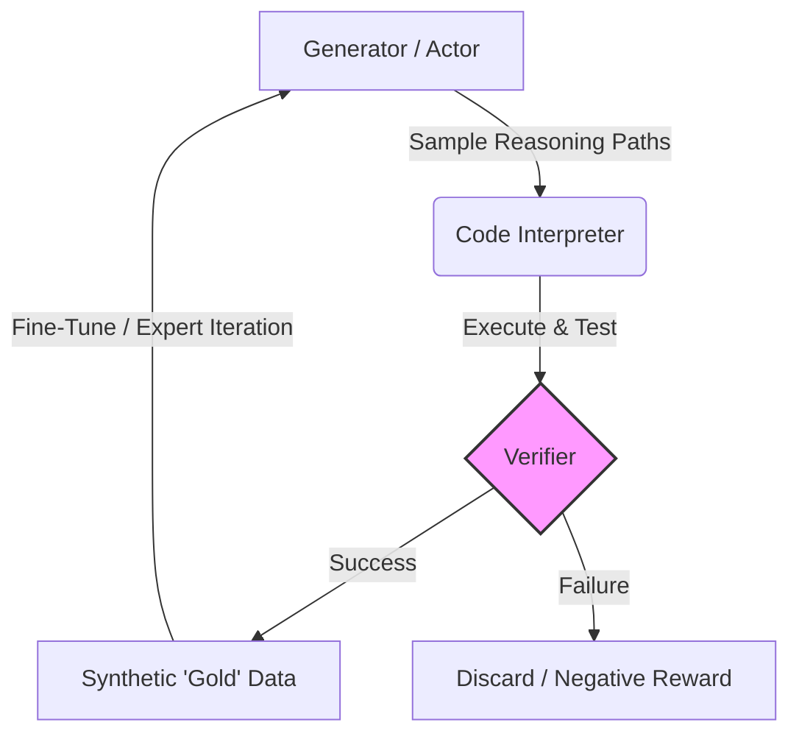

# axiom-rl

**Self-Improving Reasoning via Verifiable Value Functions**

[](https://opensource.org/licenses/MIT)
[](https://www.python.org/downloads/)

---

## What We're Trying to Achieve

`axiom-rl` investigates the **"Straight Shot" to AGI**: the hypothesis that Large Language Models can achieve continual improvement not by scaling parameters, but by scaling **inference-time compute** and **self-verification**.

### The Core Problem

Current LLMs have a fundamental limitation:
- **Strong at mimicry** - They excel at predicting the next token based on training data
- **Weak at reasoning** - They lack robust "value functions" (intuition for correctness)
- **Dependent on human feedback** - Standard RLHF requires finite, subjective human supervision

### Our Solution: Expert Iteration with Verifiable Rewards

Instead of human supervision, we use **objective verification** (code execution) as the reward signal:

```
┌─────────────────────────────────────────────────────────────────────────────┐
│                         THE AXIOM-RL LOOP                                   │
├─────────────────────────────────────────────────────────────────────────────┤
│                                                                             │
│   ┌─────────────┐      ┌─────────────┐      ┌─────────────┐                │
│   │  GENERATE   │ ──── │   VERIFY    │ ──── │   LEARN     │                │
│   │  (Explore)  │      │  (Execute)  │      │  (Update)   │                │
│   └─────────────┘      └─────────────┘      └─────────────┘                │
│         │                    │                    │                         │
│         ▼                    ▼                    ▼                         │
│   Model generates      Python sandbox       Train on verified              │
│   candidate code       runs tests           successful solutions           │
│                                                                             │
│   KEY INSIGHT: The test cases are the ENVIRONMENT, not the TEACHER         │
│   The model must DISCOVER solutions, not MEMORIZE them                     │
│                                                                             │
└─────────────────────────────────────────────────────────────────────────────┘
```

### Why This Is Different From Supervised Learning

| Aspect | Traditional Supervised Learning | Axiom-RL (Expert Iteration) |
|--------|--------------------------------|----------------------------|
| **Training Signal** | Human-written "gold" solutions | Model's own verified outputs |
| **What's Labeled** | The exact code to produce | The *behavior* (input→output) |
| **Learning Goal** | Mimic human code style | Discover *any* working solution |
| **Data Source** | Static human dataset | Self-generated, infinitely scalable |

---

## Results Summary

### Experiment Results at a Glance

| Experiment | Technique | Key Result | Status |
|------------|-----------|------------|--------|
| **Exp 01** | Baseline Evaluation | 85% overall accuracy | ✅ Complete |
| **Exp 09** | Hard Problems Baseline | 60% on LeetCode-hard | ✅ Complete |
| **Exp 10** | GRPO on Edit Distance | **0% → 100%** in 5 steps | ✅ Complete |
| **Exp 11** | Teacher Distillation | **0% → 100%** on Coin Change/Knapsack | ✅ Complete |
| **Exp 12** | GRPO on N-Queens | Failed (model capacity limit) | ✅ Complete |
| **Exp 13** | DeepSeek 1.3B Test | 90% overall, N-Queens still 40% | ✅ Complete |
| **Exp 15** | M-GRPO with Entropy | 99% training, 10% eval (format bug) | ✅ Complete |
| **Exp 16** | M-GRPO with Class Fix | **10% → 50%** (5x improvement) | ✅ Complete |
| **Exp 17** | Internal RL | Implementation ready | 🚧 In Progress |

### Key Discoveries

1. **RL from execution feedback works**: Edit Distance went from 0% to 100% accuracy using only pass/fail signals from code execution
2. **Output format matters more than training success**: 99% training success with wrong format = 10% real accuracy
3. **Model capacity limits exist**: N-Queens requires 1.5B+ parameters regardless of training technique
4. **Hierarchical RL may be the answer**: Token-level RL is inefficient; abstract action RL (Exp 17) shows promise

---

## Experiments

### Experiment 10: GRPO Hard Problems (Major Breakthrough)

**Status:** ✅ Complete | [Full Report](experiments/10_grpo_hard_problems/README.md)

Used GRPO reinforcement learning to teach algorithms the model previously failed on.

```
╔════════════════════════════════════════════════════════════════════════════╗
║                   EDIT DISTANCE: 0% → 100% IN 5 STEPS                      ║
╠════════════════════════════════════════════════════════════════════════════╣
║                                                                            ║
║  Before GRPO   ░░░░░░░░░░░░░░░░░░░░░░░░░░░░░░░░░░░░░░░░░░░░░░░░  0%       ║
║                                                                            ║
║  After GRPO    ████████████████████████████████████████████████ 100%      ║
║                                                                            ║
║  Training Time: ~25 minutes on RTX 3080                                    ║
╚════════════════════════════════════════════════════════════════════════════╝
```

**Key Findings:**
- RL from execution feedback teaches genuine algorithmic patterns
- Transfer learning from related algorithms accelerates learning
- Small models (0.5B) can learn complex DP algorithms with efficient RL

---

### Experiment 11: Teacher Distillation Hard

**Status:** ✅ Complete | [Full Report](experiments/11_teacher_distillation_hard/README.md)

Used Gemini 2.5 Flash to generate verified solution traces, then SFT-trained a 0.5B model.

| Problem | Before | After | Training Traces |
|---------|--------|-------|-----------------|
| Coin Change | 0% | **100%** | 8 traces |
| Knapsack | 0% | **100%** | 9 traces |
| N-Queens | 40% | 40% | 16 traces (failed) |

**Key Finding:** N-Queens represents a **complexity threshold** between 0.5B and 1.5B parameters.

---

### Experiment 16: M-GRPO with Class Wrapper Fix

**Status:** ✅ Complete | [Full Report](experiments/16_mgrpo_class_fix/README.md)

Fixed a critical output format bug - achieved **5x accuracy improvement**.

```
╔════════════════════════════════════════════════════════════════════════════╗
║                     EXPERIMENT 16 - 5X IMPROVEMENT                         ║
╠════════════════════════════════════════════════════════════════════════════╣
║                                                                            ║
║  Exp 15 Accuracy:  ██░░░░░░░░░░░░░░░░░░░░░░░░░░░░░░░░░░░░░░░░░░ 10%       ║
║                                                                            ║
║  Exp 16 Accuracy:  ██████████████████████░░░░░░░░░░░░░░░░░░░░░░ 50%       ║
║                                                                            ║
║  The Bug: Model output "class Solution" wrappers that broke execution      ║
║  The Fix: Extract standalone functions + explicit negative prompting       ║
╚════════════════════════════════════════════════════════════════════════════╝
```

| Metric | Exp 15 | Exp 16 | Change |
|--------|--------|--------|--------|
| Final Accuracy | 10% | **50%** | **+40%** |
| Fibonacci | 0% | 100% | Fixed |
| Binary Search | 60% | 100% | +40% |
| Coin Change | 0% | 80% | Fixed |

---

### Experiment 17: Internal RL with Temporal Abstractions

**Status:** 🚧 In Progress | [Full Report](experiments/17_internal_rl_temporal_abstractions/README.md)

Based on: ["Emergent temporal abstractions in autoregressive models enable hierarchical reinforcement learning"](https://arxiv.org/abs/2512.20605) (Kobayashi et al., Google, Dec 2025)

**The Problem with Token-Level RL:**
```
Standard RL: Explore 50K vocabulary × 100 tokens = MASSIVE search space
Internal RL: Explore 16D latent space × 5 abstract actions = TRACTABLE
```

**The Approach:**

| Phase | What | Trainable | Data |
|-------|------|-----------|------|
| 1. Pretrain | Base model learns action prediction | Base model | Expert trajectories |
| 2. Metacontroller | Discover abstract actions | Metacontroller | Same data, model frozen |
| 3. Internal RL | Learn abstract action policy | Policy only | RL from rewards |

**Expected Benefits:**

| Aspect | Token-Level RL (Exp 15-16) | Internal RL (Exp 17) |
|--------|---------------------------|---------------------|
| Action space | 50K+ tokens | 16D continuous |
| Effective horizon | ~100 tokens | ~5 abstract actions |
| Credit assignment | Very hard | Tractable |

```bash
# Run locally on RTX 3080
uv run python scripts/run_exp17_local.py --phase all --mc_epochs 10 --rl_steps 500
```

---

## Architecture

The system consists of three modules operating in a cycle:



1. **The Generator (Actor):** An open-weights model (Qwen-Coder 0.5B-1.5B) tasked with solving algorithmic problems
2. **The Verifier (Environment):** A sandboxed execution engine that runs generated Python code against test cases
3. **The Trainer (Learner):** A training loop that performs optimization on verified solutions

---

## Quick Start

### Prerequisites

- Python 3.10+
- [UV](https://docs.astral.sh/uv/) package manager
- CUDA-capable GPU (recommended: 10GB+ VRAM)

### Installation

```bash
# Clone the repository
git clone https://github.com/canivel/axiom-rl.git
cd axiom-rl

# Install with UV
uv venv
uv pip install -e .
```

### Running Experiments

```bash
# Experiment 16: M-GRPO (requires ~10GB VRAM)
uv run python scripts/run_mgrpo_exp16.py --steps 20 --eval-every 2

# Experiment 17: Internal RL (requires ~10GB VRAM)
uv run python scripts/run_exp17_local.py --phase all --mc_epochs 10 --rl_steps 500

# Test hard problems on any model
uv run python scripts/test_hard_problems.py --model Qwen/Qwen2.5-Coder-0.5B-Instruct
```

---

## Tech Stack

* **Language:** Python 3.10+
* **Inference:** `transformers`, `vLLM` (optional)
* **Training:** `peft` (LoRA), `bitsandbytes`, `pytorch`
* **Environment:** `multiprocessing` sandbox for code execution

---

## All Experiments

| # | Name | Description | Status |
|---|------|-------------|--------|
| 01 | [Baseline Evaluation](experiments/01_baseline_evaluation/) | Initial accuracy on 10 problems | ✅ |
| 02 | [Focused Improvement](experiments/02_focused_improvement/) | Targeted improvement on weak problems | 🚧 |
| 09 | [Hard Problems Baseline](experiments/09_hard_problems_baseline/) | LeetCode-hard evaluation | ✅ |
| 10 | [GRPO Hard Problems](experiments/10_grpo_hard_problems/) | RL on Edit Distance | ✅ |
| 11 | [Teacher Distillation](experiments/11_teacher_distillation_hard/) | Gemini → SFT pipeline | ✅ |
| 12 | [GRPO N-Queens Analysis](experiments/12_grpo_nqueens_analysis/) | N-Queens capacity study | ✅ |
| 13 | [DeepSeek Architecture](experiments/13_deepseek_architecture_test/) | Alternative model test | ✅ |
| 15 | [M-GRPO Entropy](experiments/15_mgrpo_entropy/) | Momentum GRPO | ✅ |
| 16 | [M-GRPO Class Fix](experiments/16_mgrpo_class_fix/) | Format bug fix | ✅ |
| 17 | [Internal RL](experiments/17_internal_rl_temporal_abstractions/) | Hierarchical RL | 🚧 |

---

## Model Comparison

| Model | Params | Overall Hard | N-Queens | Fits 10GB? |
|-------|--------|--------------|----------|------------|
| Qwen 0.5B | 494M | 60% | 40% | Yes |
| DeepSeek 1.3B | 1.3B | 90% | 40% | Yes |
| **Qwen 1.5B** | **1.5B** | **90%** | **100%** | **Yes** |

**Recommendation:** Use **Qwen2.5-Coder-1.5B-Instruct** as the minimum viable model for full algorithmic coverage.

---

## References

* **Ilya Sutskever:** *The Age of Research / Safe Superintelligence*
* **DeepMind:** *AlphaZero* (Self-play reinforcement learning)
* **DeepSeek:** *DeepSeek-R1 / Coder* (Reasoning architectures)
* **Google:** *Emergent temporal abstractions* (Dec 2025) - basis for Exp 17
* **Research Papers:**
  * *STaR: Self-Taught Reasoner* (Zelikman et al.)
  * *Expert Iteration* (Anthony et al.)
  * *GRPO* (DeepSeek)

---

## Author

**Danilo Canivel**

## License

MIT License - See [LICENSE](LICENSE) for details.
